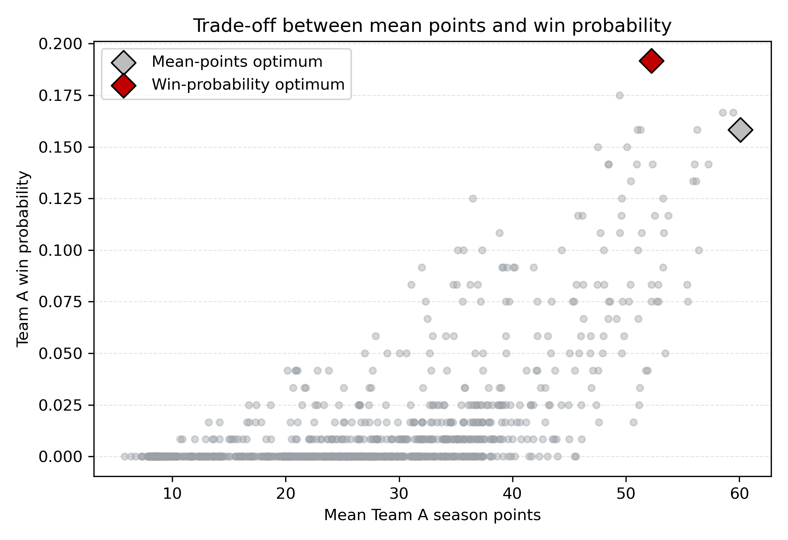
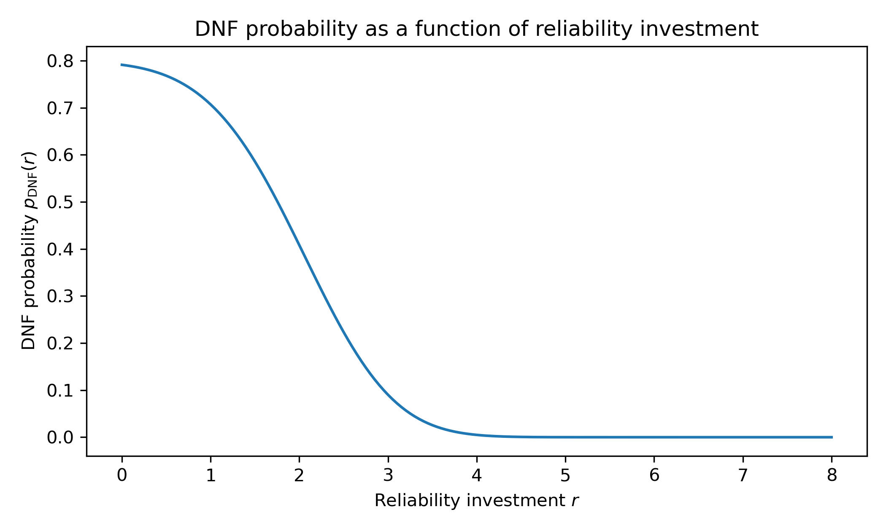
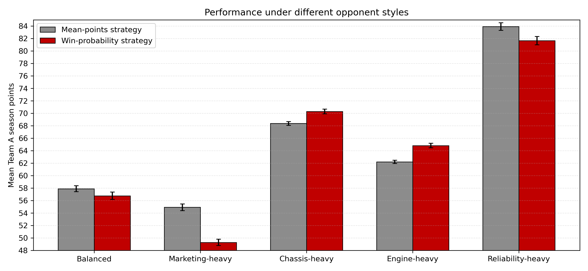

# F1 Monte Carlo Strategy Model

Python-based Monte Carlo simulation and optimisation project exploring strategic budget allocation in a Formula 1-style championship environment.

## Project Overview

This project investigates how a racing team should allocate a fixed budget across:

- Marketing
- Chassis development
- Engine development
- Reliability

to maximise season performance under uncertainty.

The model simulates:

- Probabilistic driver recruitment
- Circuit-dependent car performance
- Mechanical failures (DNFs)
- Full 10-race championship seasons
- Championship win probabilities

## Key Features

- Sequential stochastic driver-signing model
- Monte Carlo season simulation
- Mean-points vs championship-win optimisation
- Sensitivity and robustness analysis
- Opponent-style scenario testing
- Confidence intervals and paired simulations
- Data visualisation using Matplotlib

## Example Results

### Trade-off between consistency and championship upside



### Reliability investment vs DNF probability



### Opponent sensitivity



## Repository Contents

```text
core_model.py
search_optimisation.py
sensitivity_analysis.py
MATH3001_PATEL_REPORT.pdf
figures/*.png

Note: source files are currently stored in nested `src` folders.

## Methods Used

- Monte Carlo simulation
- Simulation-based optimisation
- Sensitivity analysis
- Probabilistic modelling
- Paired simulation techniques
- Confidence interval estimation

## Technologies

- Python
- NumPy
- Matplotlib

## Author

Kiran Patel  
BSc Natural Sciences (Mathematics & Environmental Science)  
University of Leeds
